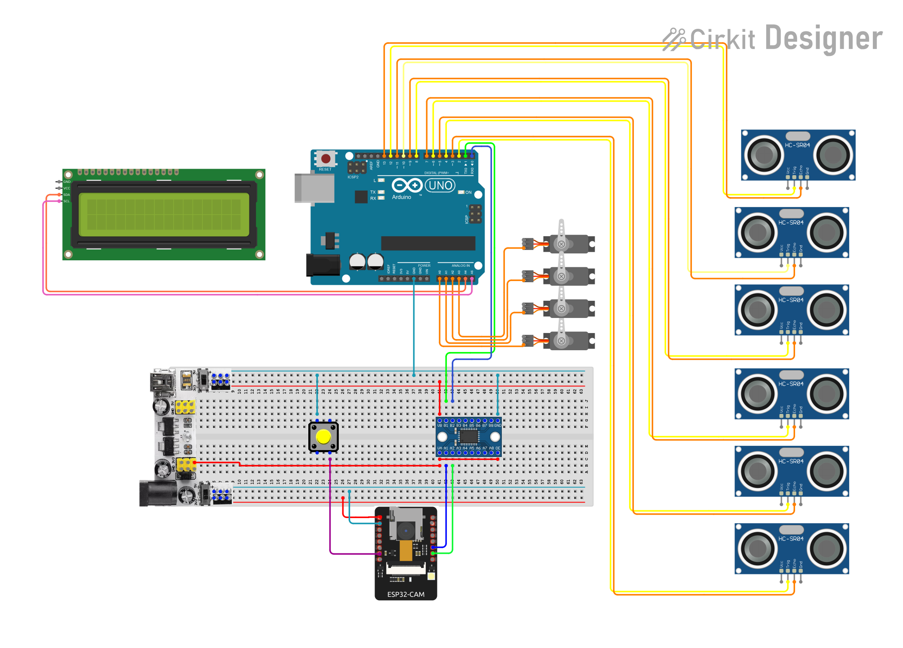
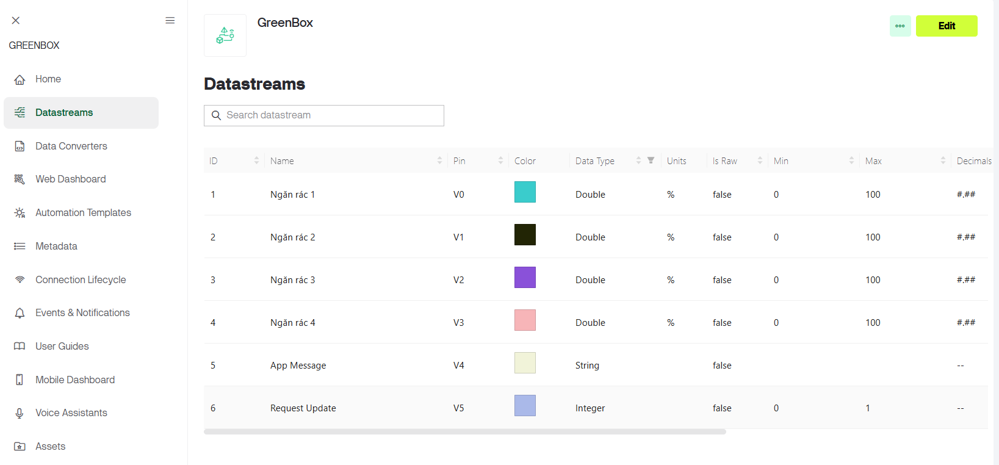
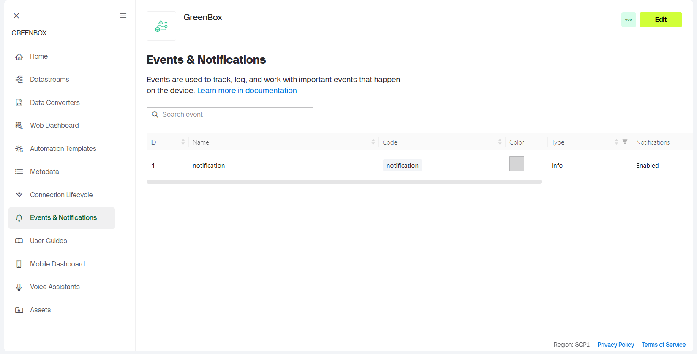
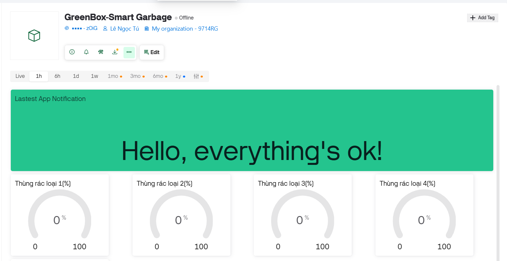
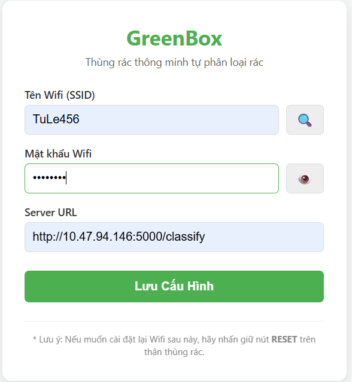

# Table of content
- [Giới thiệu](#1)
- [Hướng dẫn tải và chạy](#2)

# Giới thiệu<a name = "1"></a>
## Green Box – A smart garbage bin that automatically classifies waste based on IoT and AI.

> Bài tập nhóm môn IoT và ứng dụng PTITHCM  

## Thành viên nhóm
| Họ và tên      | MSSV       |
|----------------|------------|
| Đàm Huy Sơn    | N22DCCN169 |
| Huỳnh Phát Tài | N22DCCN171 |
| Văn Minh Tấn   | N22DCCN175 |
| Lê Ngọc Tú     | N22DCCN193 |


Green Box là hệ thống thùng rác thông minh sử dụng công nghệ xử lý ảnh (AI/Deep Learning) để tự động phân loại rác thải. Hệ thống bao gồm:
1.  **Server:** Chạy mô hình YOLO để nhận diện rác từ ảnh.
2.  **ESP32-CAM:** Chụp ảnh rác, gửi lên server và nhận kết quả phân loại; kết nối và giởi thông báo rác đầy đến Blynk.
3.  **Arduino Uno R3:** Mạch chính điều khiển linh kiện phần cứng.


# Hướng dẫn tải và chạy<a name = "2"></a>

## Clone repo nếu chưa tải

```commandline
git clone https://github.com/TuLe142857/greenbox.git
```

## Chạy server với docker
### Build & run

```commandline
    cd server
    docker compose -p greenbox up -d --build  
```

> [!NOTE] Server mặc định chạy trên port 5000  
> Server sẽ lưu toàn bộ ảnh được gởi lên phân loại qua api `/classify` vào thư mục `server/images`  
> Model phân loại rác lưu ở `server/models`, mặc định dùng [yolo11s_640x640_2-1.pt](server/models/yolo11s_640x640_2-1.pt)
> nếu dùng model khác, chuyển file model đó vào mục `server/models` và truy cập http://localhost:5000/ để chọn model được sử dụng

### Show logs
```commandline
    docker compose -p greenbox logs -f
```

### Shutdown
```commandline
    docker compose -p greenbox down
```

## Cấu hình Blynk cho ESP32-CAM
-  Copy file `esp32-cam/src/blynk_config.example.h` thành file `esp32-cam/src/blynk_config.h`
và điền các giá trị cần thiết theo mẫu

```commandline
cd greenbox
cp esp32-cam/src/blynk_config.example.h esp32-cam/src/blynk_config.h
```

> [!NOTE] Cấu hình Blynk để có thể chạy với project  
> Tạo tài khoản Blynk, create template với ESP32 sau đó cấu hình datastream và notifications như sau:
> 
> 
> 

## Nạp code cho ESP32-CAM và Arduino Uno R3
- ESP32-CAM và Arduino được code với PlatformIO, cần tải VSCode và cài extension PlatformIO để nạp code cho thuận tiện

## Khởi động hệ thống
- Nên chạy server trước để lấy địa chỉ của server
- Cấp nguồn cho linh kiện, arduino, esp32-cam
- Mặc định ESP32-CAM sẽ đọc cấu hình `wifi_ssid`, `wifi_password` và `server_url` được lưu trong nvram
- Lần đầu chạy, nvram chưa có cấu hình nên ESP32-CAM sẽ tạo wifiAP có tên `GreenBox Setup`, truy cập vào đó để setup
(server url sẽ có dạng `[server_ip]:5000/classify`). Các lần khởi động sau ESP32-CAM sẽ tự đọc cấu hình lưu trong nvram
để kết nối wifi và server.
- 
- Khi muốn đổi wifi_ssid/wifi_password/server_url cần ấn nút reset (nối với chân GPIO 2 của ESP32-CAM) để ESP xóa
config cũ và tạo wifiAP + webserver để config